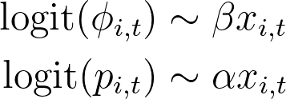
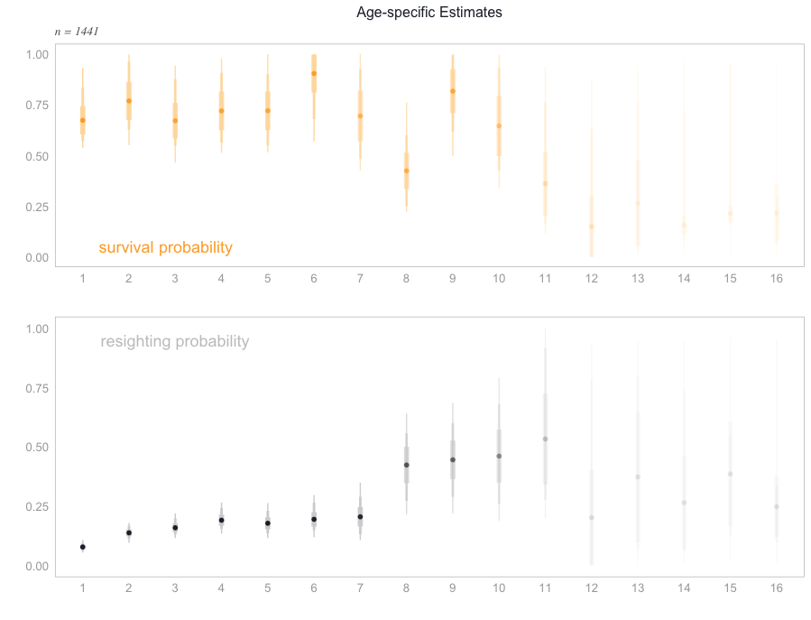
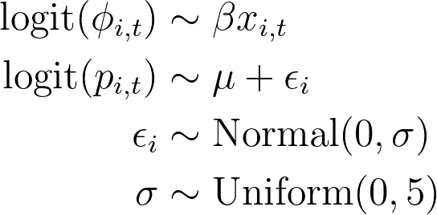
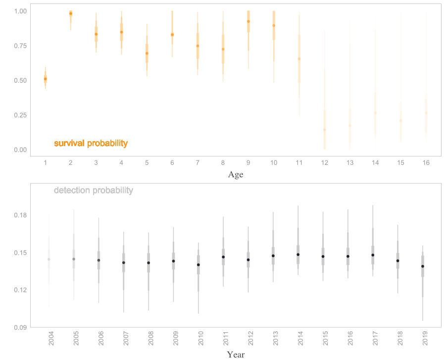

# TUVU Survival

The dataset summarizes ~20 years of Turkey Vulture wing-tagging efforts led by Stuart Houston and Marten Stoffel. Tagging was mostly done with hatch-years, but there was some success trapping adults by waiting until they entered the nest site (usually an abandoned farm house), blocking off all exists, and then sending in some poor soul  to tackle them. Work was mostly completed in Saskatchewan with some tagging in Alberta. Resighting locations are dispersed throughout AB and SK, and all the way down to tuvu wintering grounds in South America. 

Models were made with hatch years only to ensure age was known. A total of 1441 hatch years were tagged over 17 years, with ~370 of them having confirmed resights. The oldest individual was resighted at 16 years, and 17 individuals were confirmed as breeders in the local population at 6 to 8 years of age.

## Visual Summary
<p float="center">
  
  
</p>


## Model Results
### phi ~ age, p ~ age
```models/cjs_age_phi_p.stan```
<p float="center">
  
</p>


<p float="center">
  
</p>

### phi ~ fixed age, p ~ random(year)
```models/cjs_age_phi_ran.stan```

<p float="center">
  
</p>
<p float="center">
  
</p>

cjs_age_fixed_ran_fig.png
```
├── /data
│    ├── resight.csv                             <- merged tagging and resights datasets
│    ├── resight_balanced.csv                    <- produced with clean.R, closer to MR data
│    ├── hm_transmitter.parquet                  <- transmitter data from movebank, converted to parquet for compression
│    ├── sighting_data.xlsx                      <- reference only 
│    ├── Natal Dispersal TUVU20Mar2019ZJz.xlsx   <- reference only        
│    ├── banded.csv                              <- reference only 
│    ├── 12.Dec.2019_TUVU_Distance_Bearing_KG.xlsx <- reference only           
│    └── 12.Dec.2019_TUVU_All_Sighting_Data.xlsx   <- reference only           
│
├── /scripts 				
│    ├── clean.R          <- legacy      
│    ├── cjs_const.jl     <- julia translation of constant parm model, not included in stan scripts
│    ├── cjs_age.R        <- run cjs_phi_p.stan
│    ├── cjs_age-time.R   <- run cjs_phi_ran.stan
│    └── clean_ch.R       <- produce capture history from banded/resight.csv
│
├── /models 				
│    ├── cjs_phi_p.stan        <- age as categorial fixed effects on survival and detection
│    └── cjs_phi_ran.stan      <- age as categorical on survival, ranef for year on detection (account for sampling effort)
│
└── /documents 				
     └── tuvu.jpg      <- basic tagging location map displayed on readme

```

### Authors
* Erik Hedlin
* Stuart Houston
* Marten Stoffel
* Ryan Fisher
* Tom Perry
* Jean-Francois Therrien
* Kyron Giroux

