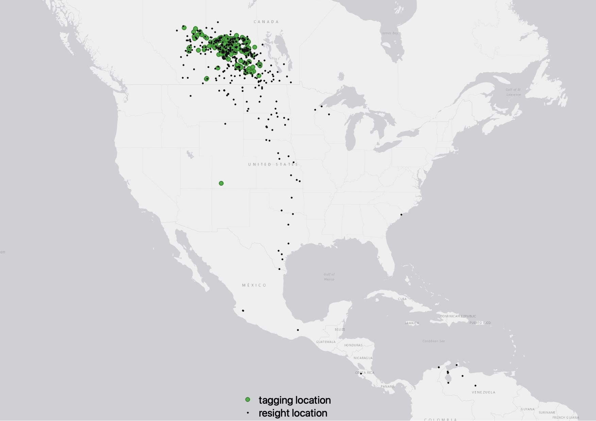
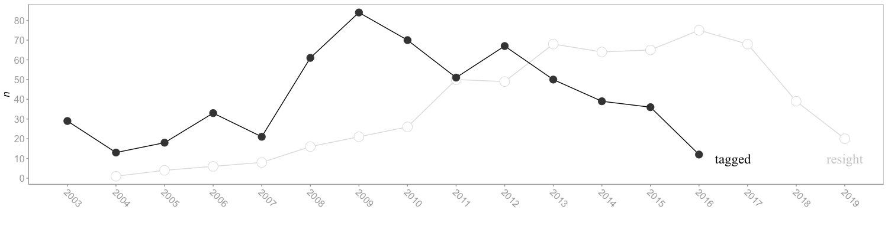
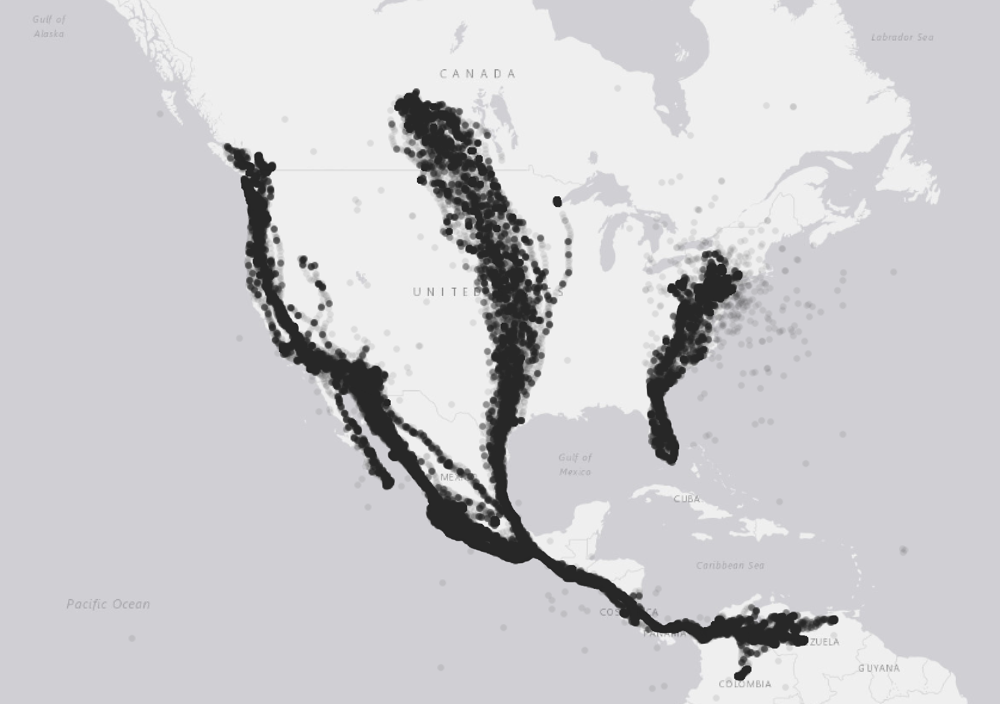

# TUVU Survival

The dataset summarizes ~20 years of Turkey Vulture wing-tagging efforts led by Stuart Houston and Marten Stoffel. Tagging was mostly done with hatch-years, but there was some success trapping adults by waiting until they entered the nest site (usually an abandoned farm house), blocking off all exists, and then sending in some poor soul  to tackle them. Work was mostly completed in Saskatchewan with some tagging in Alberta. Resighting locations are dispersed throughout AB and SK, and all the way down to tuvu wintering grounds in South America. 


<p float="center">
  
  
</p>

And transmitter data downloaded from [movebank.org](https://www.movebank.org/cms/webapp?gwt_fragment=page=studies,path=study217784323). Code in ```clean.R``` to isolate SK birds. Because of its size, transmitter data has been compressed to parquet, use ```arrow::read_parquet``` to load.


<p float="center">
  
</p>


```
├── /data
│    ├── resight.csv                             <- merged tagging and resights datasets
│    ├── resight_balanced.csv                    <- produced with clean.R, closer to MR data
│    ├── hm_transmitter.parquet                  <- transmitter data from movebank, converted to parquet for compression
│    ├── sighting_data.xlsx                      <- reference only 
│    ├── Natal Dispersal TUVU20Mar2019ZJz.xlsx   <- reference only        
│    ├── banded.csv                              <- reference only 
│    ├── 12.Dec.2019_TUVU_Distance_Bearing_KG.xlsx <- reference only           
│    └── 12.Dec.2019_TUVU_All_Sighting_Data.xlsx   <- reference only           
│
├── /scripts 				
│    └── clean.R       <- produces data/resight_balanced.csv
│
└── /documents 				
     └── tuvu.jpg      <- basic tagging location map displayed on readme

```

### Authors
* Erik Hedlin
* Stuart Houston
* Marten Stoffel
* Ryan Fisher
* Tom Perry
* Jean-Francois Therrien
* Kyron Giroux

